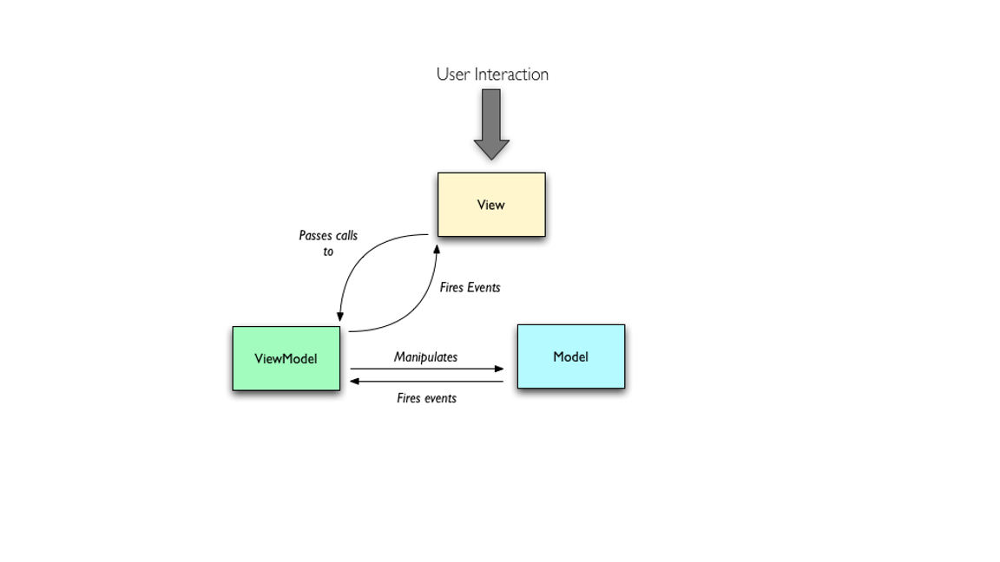
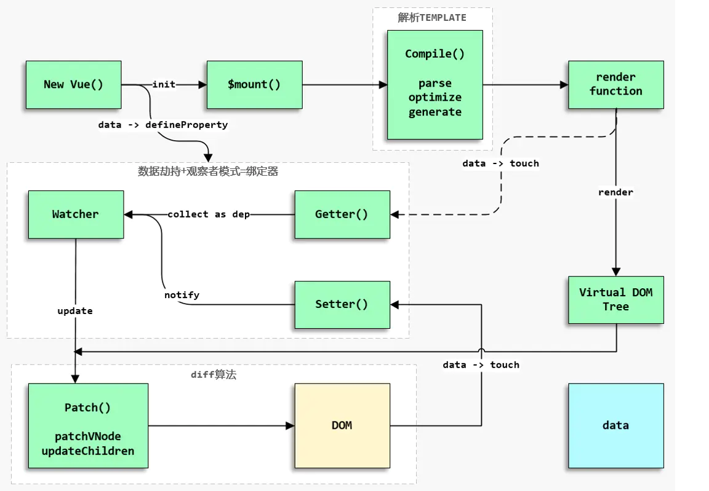
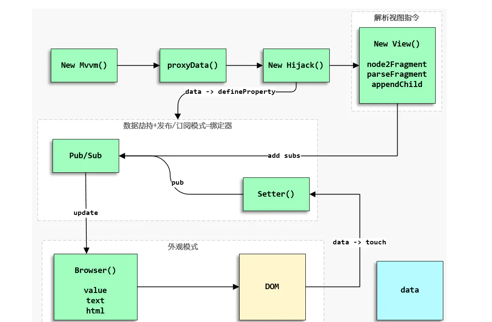

# MVVM
***
+ 数据驱动页面
+ 通过数据劫持+发布订阅模式，实现监控数据变化，跟新页面

+ ViewModel：内部集成了Binder(Data-binding Engine，数据绑定引擎)，Binder会实现View和Model的双向绑定，从而实现View或Model的自动更新。
+ View：可组件化，例如目前各种流行的UI组件框架，View的变化会通过Binder自动更新相应的Model。
+ Model：Model的变化会被Binder监听(仍然是通过观察者模式)，一旦监听到变化，Binder就会自动实现视图的更新。
## vue

## 实现一

```javascript
<!DOCTYPE html>
<html lang="en">
<head>
  <meta charset="UTF-8">
  <meta name="viewport" content="width=device-width, initial-scale=1.0">
</head>
<body>
    <div id='app'>
        <h3>姓名</h3>
        <p>{{name}}</p>
        <h3>年龄</h3>
        <p>{{age}}</p>
    </div>
</body>
</html>
<script>
document.addEventListener('DOMContentLoaded', function(){
    let opt = {el:'#app', data:{name:'检索中...', age:30}}
    let vm = new Vue(opt)
    setTimeout(() => {
        opt.data.name = '王永峰'
    }, 2000);
}, false)
class Vue{
    constructor(opt){
        this.opt = opt
        this.observe(opt.data)
        let root = document.querySelector(opt.el)
        this.compile(root)
    }
    // 为响应式对象 data 里的每一个 key 绑定一个观察者对象
    observe(data){ 
        Object.keys(data).forEach(key => {
            let obv = new Observer() 
            data["_"+key] = data[key]
            // 通过 getter setter 暴露 for 循环中作用域下的 obv，闭包产生
            Object.defineProperty(data, key, {
                get(){
                    Observer.target && obv.addSubNode(Observer.target);
                    return data['_'+key]
                }, 
                set(newVal){
                    obv.update(newVal)
                    data['_'+key] = newVal  
                   // 避免调用data[key]又触发get事件，set事件
                }
            })
        })
    }
    // 初始化页面，遍历 DOM，收集每一个key变化时，随之调整的位置，以观察者方法存放起来    
    compile(node){
        [].forEach.call(node.childNodes, child =>{
            if(!child.firstElementChild && /\{\{(.*)\}\}/.test(child.innerHTML)){
                let key = RegExp.$1.trim()
                child.innerHTML = child.innerHTML.replace(new RegExp('\\{\\{\\s*'+ key +'\\s*\\}\\}', 'gm'),this.opt.data[key]) 
                Observer.target = child
                this.opt.data[key]    // 调用get事件，加入节点
                Observer.target = null
            }
            else if (child.firstElementChild) 
            this.compile(child)
        })
    }    
}
// 常规观察者类
class Observer{
    constructor(){
        this.subNode = []    
    }
    addSubNode(node){
        this.subNode.push(node)
    }
    update(newVal){
        this.subNode.forEach(node=>{
            node.innerHTML = newVal
        })
    }
}
</script>

```
## 实现二

+ 创建MVVM实例对象，初始化实例对象的options参数
+ proxyData将MVVM实例对象的data数据代理到MVVM实例对象上
+ Hijack类实现数据劫持功能（对MVVM实例跟视图对应的响应式数据进行监听，这里和Vue运行机制不同，干掉了getter依赖搜集功能）
+ 解析视图指令，对MVVM实例与视图关联的DOM元素转化成文档碎片并进行绑定指令解析（b-value、b-on-input、b-html等，其实是Vue编译的超级简化版），
+ 添加数据订阅和用户监听事件，将视图指令对应的数据挂载到Binder数据绑定引擎上（数据变化时通过Pub/Sub模式通知Binder绑定器更新视图）
+ 使用Pub/Sub模式代替Vue中的Observer模式
+ Binder采用了命令模式解析视图指令，调用update方法对View解析绑定指令后的文档碎片进行更新视图处理
+ Browser采用了外观模式对浏览器进行了简单的兼容性处理.
#### 中介者模式
最简单的中介者模式只需要实现发布、订阅和取消订阅的功能。发布和订阅之间通过事件通道（channels）进行信息传递，可以避免观察者模式中产生依赖的情况。
```javascript
class Mediator {
  constructor() {
    this.channels = {}
    this.uid = 0
  }

  /** 
   * @Desc:   订阅频道
   * @Parm:   {String} channel 频道
   *          {Function} cb 回调函数 
   */  
  sub(channel, cb) {
    let { channels } = this
    if(!channels[channel]) channels[channel] = []
    this.uid ++ 
    channels[channel].push({
      context: this,
      uid: this.uid,
      cb
    })
    console.info('[mediator][sub] -> this.channels: ', this.channels)
    return this.uid
  }

  /** 
   * @Desc:   发布频道 
   * @Parm:   {String} channel 频道
   *          {Any} data 数据 
   */  
  pub(channel, data) {
    console.info('[mediator][pub] -> chanel: ', channel)
    let ch = this.channels[channel]
    if(!ch) return false
    let len = ch.length
    // 后订阅先触发
    while(len --) {
      ch[len].cb.call(ch[len].context, data)
    }
    return this
  }

  /** 
   * @Desc:   取消订阅  
   * @Parm:   {String} uid 订阅标识 
   */  
  cancel(uid) {
    let { channels } = this
    for(let channel of Object.keys(channels)) {
      let ch = channels[channel]
      if(ch.length === 1 && ch[0].uid === uid) {
        delete channels[channel]
        console.info('[mediator][cancel][delete] -> chanel: ', channel)
        console.info('[mediator][cancel] -> chanels: ', channels)
        return
      }
      for(let i=0,len=ch.length; i<len; i++) {
          if(ch[i].uid === uid) {
            ch.splice(i,1)
            console.info('[mediator][cancel][splice] -> chanel: ', channel)
            console.info('[mediator][cancel] -> chanels: ', channels)
            return
          }
      }
    }
  }
}


// 监听数据变化
var hijack = (function() {

  class Hijack {
    /** 
     * @Desc:   数据劫持构造函数
     * @Parm:   {Object} model 数据 
     *          {Object} mediator 发布订阅对象 
     */  
    constructor(model, mediator) {
      this.model = model
      this.mediator = mediator
    }
  
    /** 
     * @Desc:   model数据劫持
     * @Parm:   
     *          
     */  
    hijackData() {
      let { model, mediator } = this
      for(let key of Object.keys(model)) {
        let val = model[key]
        Object.defineProperty(model, key, {
          enumerable: true,
          configurable: false,
          get() {
            return val
          },
          set(newVal) {
            if(newVal === val) return
            val = newVal
            // 发布数据劫持的数据变化信息
            console.log('[mediator][pub] -> key: ', key)
            // 重点注意这里的通道，在最后的MVVM示例中和这里的实现不一样
            mediator.pub(key)
          }
        })
      }
    }
  }

  return (model, mediator) => {
    if(!model || typeof model !== 'object') return
    new Hijack(model, mediator).hijackData()
  }
})()


// 模型
let model = {
  message: 'Hello World',
  setData(key, newVal) {
    let val = this
    let keys = key.split('.')
    for(let i=0, len=keys.length; i<len; i++) {
      if(i < len - 1) {
        val = val[keys[i]]
      } else {
        val[keys[i]] = newVal
      }
    }
    // console.log('[mvvm][setData] -> val: ', val)
  },
  getData(key) {
    let val = this
    let keys = key.split('.')
    for(let i=0, len=keys.length; i<len; i++) {
      val = val[keys[i]]
      if(!val && i !== len - 1) { throw new Error(`Cannot read property ${keys[i]} of undefined'`) }
    }
    return val
  }
}

(function(window, browser){
  window.binder = {
    /** 
     * @Desc:   判断是否是绑定属性 
     * @Parm:   {String} attr Node节点的属性 
     */  
    is(attr) {
      return attr.includes('b-')
    },
    /** 
     * @Desc:   解析绑定指令
     * @Parm:   {Object} attr html属性对象
     *          {Object} node Node节点
     *          {Object} model 数据
     */  
    parse(node, attr, model) {
	  // 判断是否是绑定指令，不是则不对该属性进行处理
      if(!this.is(attr.name)) return
      // 获取model数据
      this.model = model 
      // b-value = 'message'， 因此attr.value = 'message'
      let bindValue = attr.value,
	      // 'b-value'.substring(2) = value
          bindType = attr.name.substring(2)
      // 绑定视图指令b-value处理
      // 这里采用了命令模式
      this[bindType](node, bindValue.trim())
    },
    /** 
     * @Desc:   值绑定处理(b-value)
     * @Parm:   {Object} node Node节点
     *          {String} key model的属性
     */  
    value(node, key) {
    this.update(node, key)
    browser.event.add(node, 'input', (e) => {
        // 更新model
        let newVal = browser.event.target(e).value
        // 设置对应的model数据(因为进行了hijack(model))
        // 因为进行了hijack(model)，对model进行了变化监听，因此会触发hijack中的set，从而触发set中的mediator.pub
        this.model.setData(key, newVal)
      })

	  // 一旦model变化，数据劫持会mediator.pub变化的数据		
      // 订阅数据变化更新视图(闭包)
      this.mediator.sub(key, () => {
        console.log('[mediator][sub] -> key: ', key)
        console.log('[mediator][sub] -> node: ', node)
        this.update(node, key)
      })
    },
    /** 
     * @Desc:   值绑定更新(b-value)
     * @Parm:   {Object} node Node节点
     *          {String} key model的属性
     */  
    update(node, key) {
	  // this.model.getData是用于获取model对象的属性值
	  // 例如 model = { a : { b : 111 } }
	  // <input type="text" b-value="a.b" />
	  // this.model.getData('a.b') = 111
	  // 从而可以将input元素更新为<input type="text" value="111" />
	  browser.val(node, this.model.getData(key))
    }
  }
})(window, browser)


```


作者：子弈
链接：https://juejin.im/post/5cd8a7c1f265da037a3d0992
